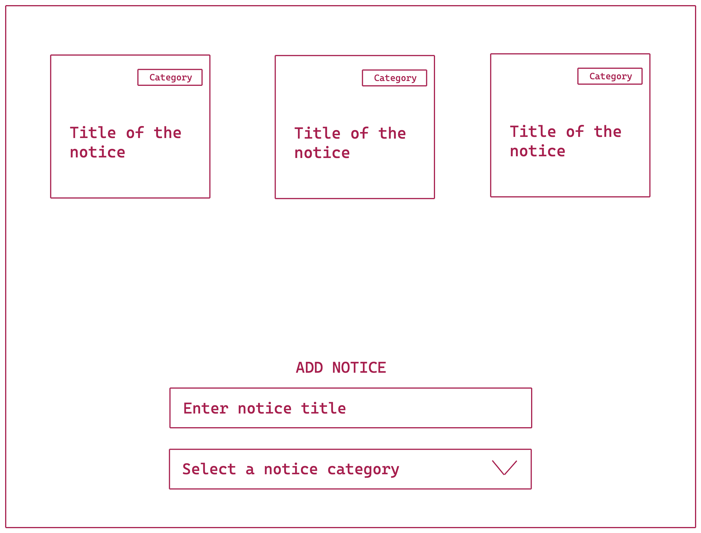

## Notice Board

- Create a notice board
- Using input box and title you can add a new notice
- While adding a notice you will also choose a category
- Once the notice is added it will be visible on the top
- Using double click on the title or the category will allow the user to edit the text.
- When you click outside (blur) of the respective element or press enter the title or category will get updated to the new value.
- Add local storage support
\
## Demo



```js
let form = document.querySelector('form');
let ul = document.querySelector('ul');


let cardsData = JSON.parse(localStorage.getItem('cards'));
    

form.addEventListener('submit',(event)=>{
    event.preventDefault();

    let title = event.target.elements.title.value;
    let category = event.target.elements.category.value 
    cardsData.push({title,category});
    localStorage.setItem('cards',JSON.stringify(cardsData))
    createUI(cardsData, ul);

});   

function handleEdit(event){
    let elm = event.target; 
    let input = documen.createElement('input');
    let parent = event.targrt.parentElement;
    parent.replaceChild()
}

function createUI(data,root){
    let fragment = new DocumentFragment();
    data.forEach((cardInfo) => { 
         let li = document.createElement('li');
         let p = document.createElement('p');  
         p.addEventListener('dblclick',handleEdit)
         p.innerHTML = cardInfo.category;
         let h2 = document.createElement('h2');
         h2.innerHTML = cardInfo.title;
         li.append(p, h2);
         fragment.appendChild(li)
    });
    root.append(fragment);
}
createUI(cardsData,ul);
```

```html
<!DOCTYPE html>
<html lang="en">
<head>
    <meta charset="UTF-8">
    <meta http-equiv="X-UA-Compatible" content="IE=edge">
    <meta name="viewport" content="width=device-width, initial-scale=1.0">
    <title>Cards Edit</title>
</head>
<body>
<header> User Cards</header>
<ul></ul>
<div class="add_cards">
    <form>
        <input name="title" type="text" placeholder="Enter the title">
        <input name="catagory" type="text" placeholder="Enter the catagory"> 
        <button type="submit" >Add New Items</button>

    </form>
</div> 
<script src="index.js"></script>
</body>
</html>
```
